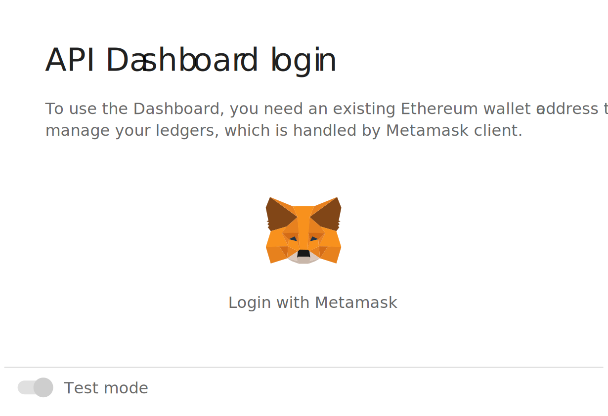

# Using dashboard

For using 0xcert API, you will need **[credits](get-credits)** which are dapp tokens derived from ZXC tokens. So if you are a ZXC holder, you can easily [convert your tokens](get-credits.html#zxc-dapp-tokens) into credits via our latest product: the **0xcert API Dashboard**.

Dashboard gives you an overall overview of you recent API activity. You can check:
* number of all requests your dapp made, 
* number of mutations and
* number of queries. 

You also have an overview of your deployed ledgers and most importantly, your current credit balance.

## Login

To use the Dashboard, you need an existing Ethereum address to manage your ledgers. The wallet needs to be handled by either [Metamask](https://metamask.io/) bridge or [Bitski](https://www.bitski.com/) wallet. So if you don't have any, you first have to create one. Once your client of choice is ready, you can login to the dashboard.

In each case you'll be asked to sign a signature request. At this point no funds are required; it's just a decentralized way to login into the dashboard with your personal wallet. So just hit the `Sign` button. No email or passwords needed. Neat! Blockchain's dope. 

## Balance

You can get top up your balance easily through `Deposit credits` button in a balance window. Read more about getting credits in the [guide here.](get-credits) Bellow credits you have a graph that shows costs you spent per day.

Unused credits can be easily be withdrawn too. Note that they will be converted into ZXC tokens, since credit dapp tokens are only available and usable inside the 0xcert API environment.

:::warning
When on mainnet, the Dashboard usage will require your valid details for accounting purposes.
:::

## Requests

In **Requests** section you can find a list of all queries and mutations your dapp made to an API client. By clicking on each line, you get all the details of specific request, so you can easily debug your dapp.

