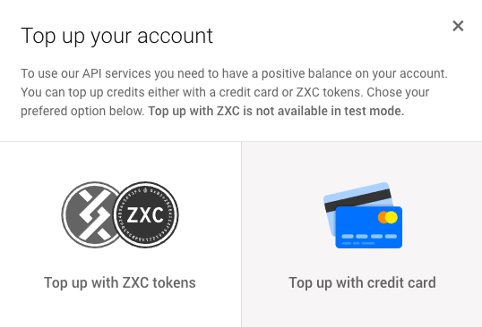

# Get credits

0xcert strives to increase adoption of blockchain technologies, which is in large part held back by its poor user experience. Payments of blockchain services are usually done with cryptocurrency, which can be a frustrating experience on its own. To circumvent this, we have vastly simplified the purchasing process and made 0xcert services much more user friendly from the beginning. 

Actions performed with the 0xcertAPI are denominated in Credits, exact pricing can be viewed on the [price list](https://dashboard.0xcert.org/costs/). There are two ways of getting Credits: (1) purchasing them with a credit card, or (2) using ZXC utility tokens purchased on external exchanges. There is also a third component that smoothens out the whole user experience, so called dapp tokens, which are known as Credits on all 0xcert services.

## ZXC and dapp tokens

The 0xcert ecosystems makes use of two different (fungible) tokens, ZXC utility tokens and dapp tokens.

* **ZXC tokens** are utility tokens used to pay for behind-the-scenes operations in dapps built using the 0xcert framework. You can think of ZXC as both a unit of value for 0xcert services and a bridge between blockchain and real-world use cases. ZXC tokens can be converted into dapp tokens.
* **Dapp tokens** are Credits users spend to buy products and services offered by individual dapps and services built on 0xcert. 

## Why dapp tokens?

The introduction of dapp tokens allows us to update our products and services in a much more dynamic way than using ZXC directly. In turn, this allows us to streamline certain processes, offer a more dynamic infrastructure overall, and help provide a cutting-edge user experiences. Using dapp tokens instead of ZXC tokens also hides the complexity of blockchain for end users, vastly improving ease of use. One of the most important ways it achieves this is through the fiat gateway. From a legal perspective, we can’t facilitate fiat-to-crypto or crypto-to-fiat payments directly without becoming an exchange. Using dapp tokens as a common denominator makes it possible for us to provide a fiat gateway without becoming an exchange.

## How does it work under the hood?

As mentioned, there are two ways of getting Credits: purchasing them with a credit card or with the use of ZXC tokens. Behind the scenes, her fiat money is exchanged for ZXC tokens, which are then swapped for credits—dapp tokens—that show up in user account. If users decide to directly use ZXC tokens, then the first step is skipped and ZXCs are directly swapped for Credits (dapp tokens).

Technically, dapp tokens are modified ERC20 tokens. They can only be used to pay for 0xcert services, cannot be cashed out, and are non-transferable. The total number of dapp tokens is dynamic and relative to the total amount of locked ZXC tokens into dapp tokens. The conversion rate between ZXC and dapp tokens is 1:1. Because of this, all calculations done in ZXC are also valid for dapp tokens, and vice versa.

Currently the price of one ZXC token is fixed at 0.042 EUR throughout all 0xcert services. For example, if an action on the 0xcertAPI is priced at 1 EUR, the cost will come out to 1 EUR/0.042 EUR = ~23.8 ZXC.

## How to get credits

There are two ways of getting credits:

1. Buy credits directly with a credit card.
2. Exchange ZXC tokens for credits.

Both ways are available on [0xcert API Dashboard](https://dashboard.0xcert.org) under `Deposit` button in Balance window.

The second, ZXC option to get credits is not available in the test mode, since you can get test credits with a credit card **for of charge**. Just follow the next section.

### Buy credits with credit card

In [0xcertAPI dashboard](https://dashboard.0xcert.org) you have a deposit option which asks you how you would like to get tokens. If you choose credit card you can select the amount and directly get credits. Exchange rate for credits is 0.042€ which means, that for 1€ you get roughly 23,8 credits. Note that credit card payment provider charges 0.5€ fee per deposit.

:::tip FREE TEST CREDITS
For rinkeby test network you can get credits for free by using credit card option and typing credit card information provided in the pop-up window.
:::

### Exchange ZXC for credits

If you own ZXC tokens you can exchange them for credits in the ration 1 ZXC = 1 credit. More information on how to do this will be available when the 0xcertAPI comes out of beta.

## Withdrawal

Credits you no longer need, can be simply withdrawn back to ZXC tokens and into your wallet, in the same 1:1 ratio. To do that, hit the `Withdraw` button in balance window and define how much credits you like to withdraw and click proceed.